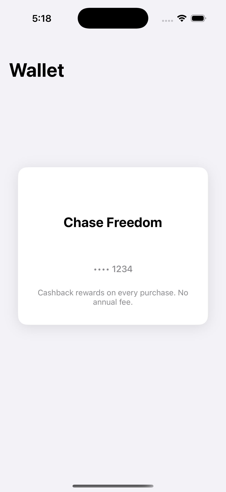

# Soar iOS Challenge

## Overview

Create a beautiful, interactive card component with custom animations. This focused challenge showcases your UIKit animation skills through a single, polished UI element.

**Time Limit: 2 hours maximum** ⏱️

## What You'll Build

An interactive wallet-style card component that responds to user gestures with smooth, custom animations. Think Apple Wallet meets beautiful design.



### Your Mission

Choose **ONE** animation to implement perfectly:

#### Option 1: Flip Card 🔄

- Tap to flip between front/back views
- 3D rotation animation with perspective
- Smooth physics and natural timing

#### Option 2: Swipe Actions 👆

- Swipe left/right to reveal action buttons
- Spring physics with rubber-band effect
- Smooth snap-back animation

#### Option 3: Expandable Card 📱

- Tap to expand/collapse with content
- Scale and fade animations
- Background dimming effect

### What We're Looking For

✅ **Smooth 60fps animations** - Performance first  
✅ **Custom UIKit code** - No pre-built components  
✅ **Clean implementation** - Well organized and readable  
✅ **Polish & details** - Handle edge cases gracefully  
✅ **Natural feel** - Animations that feel intuitive

### Bonus Points

- Haptic feedback
- Creative touches
- Accessibility support

## Getting Started

1. **Clone this repository**
2. **Open the Xcode project**
3. **Run the app** - you'll see a credit card in wallet style
4. **Pick your animation** and implement it
5. **Focus on quality** over quantity

### Project Structure

```
├── Models/CardData.swift           // Simple data model
├── Views/CardView.swift           // Your card component
├── Views/MainViewController.swift // Container view
├── Animations/CardAnimations.swift // Animation helpers
└── Extensions/UIView+Extensions.swift // Utilities
```

## Submission

Submit:

1. **GitHub link** with your implementation
2. **30-second video** showing the animation
3. **Brief explanation** of your approach

---

**Show us your animation skills! 🎨**
